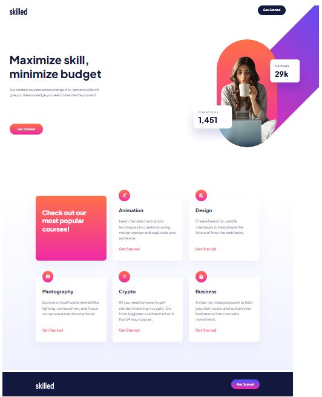
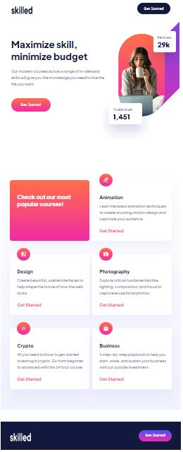
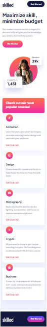

# Frontend Mentor - Skilled e-learning landing page solution

This is a solution to the [Skilled e-learning landing page challenge on Frontend Mentor](https://www.frontendmentor.io/challenges/skilled-elearning-landing-page-S1ObDrZ8q).

## Table of contents

- [Overview](#overview)
  - [The challenge](#the-challenge)
  - [Screenshot](#screenshot)
  - [Links](#links)
- [My process](#my-process)
  - [Built with](#built-with)
  - [What I learned](#what-i-learned)
  - [Continued development](#continued-development)
  - [Useful resources](#useful-resources)
- [Author](#author)

## Overview

### The challenge

I completed this challenge and users are able to:

- View the optimal layout depending on their device's screen size
- See hover states for interactive elements

### Screenshot

This is a screenshot of desktop version of the site: 
and this is tablet version: 
and here is mobile version screenshot: 

### Links

- Solution URL: [https://github.com/Aleqsa123/elearning]
- Live Site URL: [https://aleqsa123.github.io/elearning/]

## My process

### Built with

- Semantic HTML5 markup
- CSS custom properties
- Flexbox
- CSS Grid

### What I learned

This challenge was important in understanding responsive design and background picture position better. I advanced in mobile-first workflow and doing breakouts. I also understood paddings and box-sizing much better. Background positioning was again hard for me. At this time I used relative units "rem"-s.

I love this CSS:
```css
    header {
        display: grid;
        grid-template-columns: 1fr 280px;
        grid-template-rows: repeat(4, auto);
        margin-top: 2.4rem;
        padding-right: 4rem;
        padding-left: 3.9rem;
        background-image: url(./assets/image-hero-tablet.png);
        background-repeat: no-repeat;
        background-size: contain;
        background-position: top -6.5rem right -28.5rem;
    }


### Continued development

Now it's time to take projects with javascript. Also mastering markup will be useful.


### Useful resources

(https://developer.mozilla.org/en-US/) and (https://www.w3schools.com/) - These are amazing sites which helped me in backgrounding.

## Author

- Fronendmentor - [Aleqsa123] (https://www.frontendmentor.io/profile/Aleqsa123)
- Github - [Aleqsa123](https://github.com/Aleqsa123)
- Linkedin - [Aleksi Merebashvili](https://www.linkedin.com/in/aleksi-merebashvili-36627426/)
- Facebook - [Aleksi Merebashvili](https://www.facebook.com/aleksi.merebashvili)
